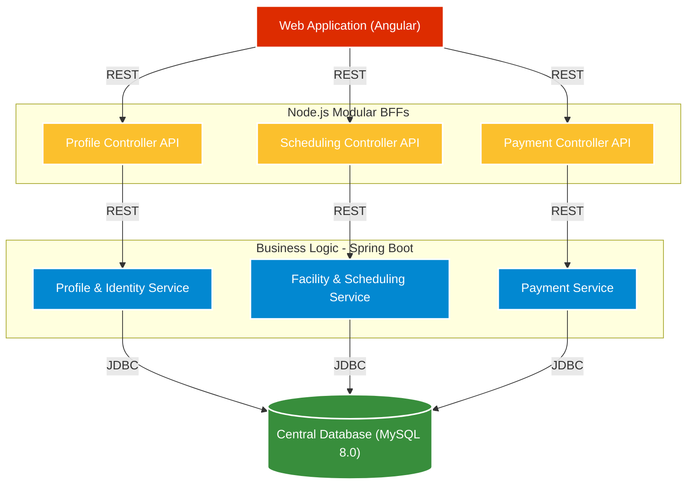
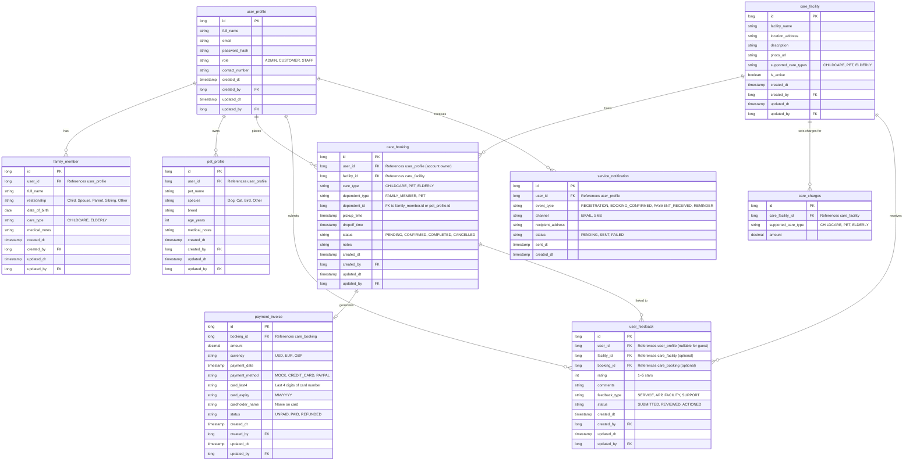
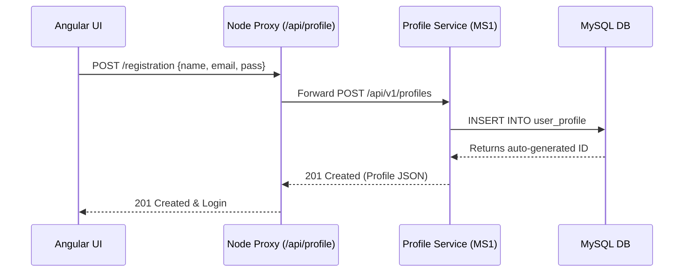
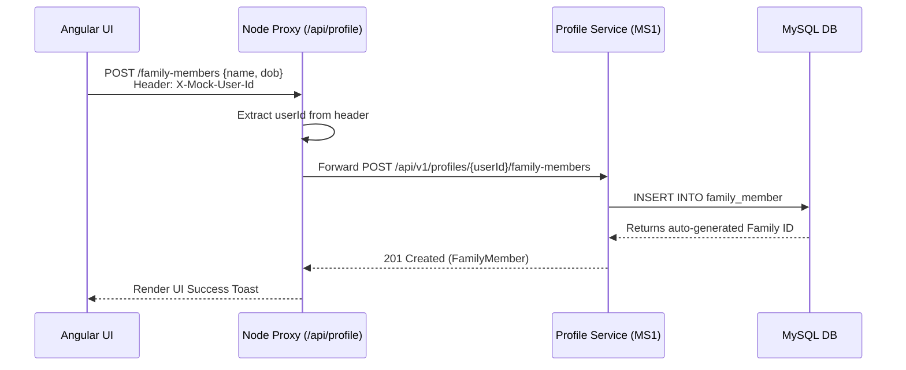
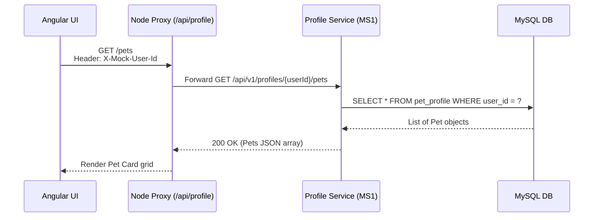
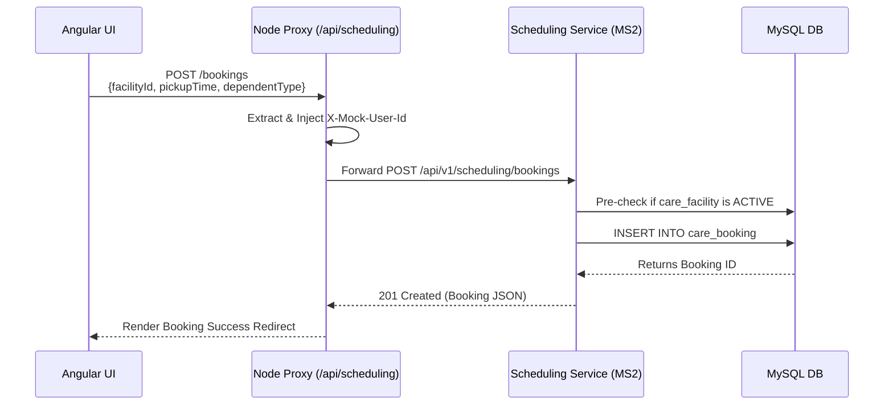
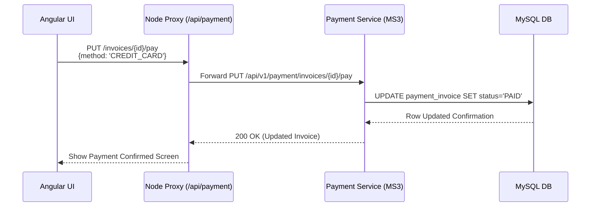
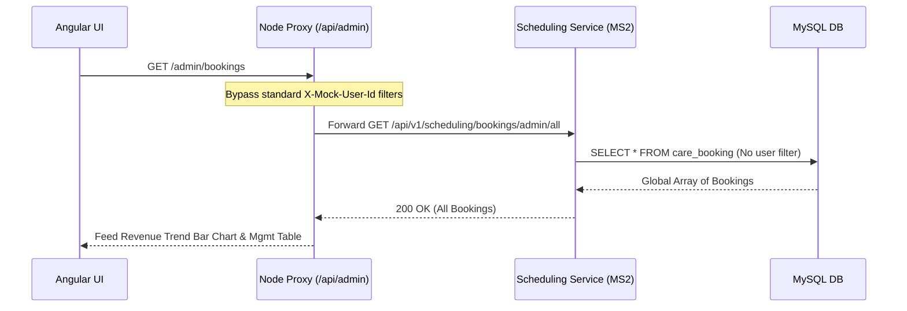

# Helping Hands Care Center (HHCC) - Global Expansion Platform Architecture

## 1. Executive Summary
This document outlines the high-level architecture design for the Helping Hands Care Center (HHCC) digital application. The goal is to provide a scalable, modern, and production-ready architecture using independent components (UI, Node REST Orchestration API, Microservices, and Database) that can be developed in parallel to meet the aggressive **1-week** MVP delivery timeline.

### 1.1 Background & Development Goals
**Helping Hands Care Center (HHCC)** currently operates a web application allowing customers to view static photos of individual Care Centers, create user profiles, schedule pick-up and drop-off times, and submit payments safely. With their Corporate and Community care center models achieving wide local success, HHCC has set ambitious growth goals to expand nationally and evolve into a global business over the next three years. 

A primary focus of this development effort is modernizing and scaling their digital capabilities to break into new markets—specifically **pet care** and **elderly care**—while dramatically improving the user experience and differentiating themselves from local competition. The architecture proposed below acts as the robust, scalable foundation necessary to launch these new lines of business and support their global growth strategy.

## 2. High-Level Architecture Diagram
The layout follows a modernized decoupled approach utilizing a Node.js REST Orchestration Layer communicating with REST-only Microservices.



---

## 3. Component Architecture and Tech Stack

### 3.0 Technology Stack Summary
| Layer | Core Technology | Version Specification |
| :--- | :--- | :--- |
| **Frontend UI** | Angular | Angular 18+ |
| **Orchestration** | Node.js (NestJS preferred) | Node.js v22+ |
| **Business Logic**| Java (Build: Maven) | **Java 21 LTS** & Spring Boot 3+ |
| **Database** | MySQL RDBMS | MySQL 8+ |

### 3.1 Presentation Layer (Angular)
- **Framework**: Angular 18+
- **Responsibility**: Manages all user interactions, UI state, and routing. Independent front-end application.
- **Components** *(vertical feature ownership)*:
  - **Home Screen** — public landing page showing services & USPs (unregistered users)
  - **User Registration & Profile Management** (Tanuj) — account creation, login, profile editing
  - **Family Member Management** (Tanuj) — add/edit/remove family members (childcare & elderly)
  - **Pet Management** (Tanuj) — add/edit/remove pet profiles
  - **Care Center Directory & Booking Wizard** (Arturo) — facility listing, schedule pick-up/drop-off
  - **Payment Dashboard** (Alpesh) — view and submit mock payments per booking
  - **Feedback & Support Screen** (Alpesh) — ratings, comments, and customer support access
- **Development Strategy**: Mocks can be generated for API responses allowing frontend development to proceed completely parallel to the backend.

### 3.2 Orchestration Layer (Modular Node.js REST API)
- **Framework**: Node.js (**NestJS** with Modular Routing — preferred for its native modular controller pattern)
- **Responsibility**: Acts as a strict REST API orchestrator bridging the UI and the backend.
- **Modular Split for Independent Development**: The Node.js application is logically split into four independent Route/Controller modules aligning with UI features and backend microservices:
  - `/api/profile` — proxies to Profile & Identity Service (MS1) — **owned by Tanuj**
  - `/api/scheduling` — proxies to Facility & Scheduling Service (MS2) — **owned by Arturo**
  - `/api/payment` — proxies to Payment Service (MS3) — **owned by Alpesh**
  - `/api/feedback` — proxies feedback & support routes to MS1 — **owned by Alpesh**
- **Benefits**: Simplifies frontend API calls, completely decouples the developer experience to support parallel vertical feature ownership, and encapsulates microservice boundaries from the public web.

### 3.3 Business Logic Layer (Spring Boot Microservices)
- **Framework**: Spring Boot 3+
- **Language**: **Java 21 (LTS)**
- **Build Tool**: Maven (`pom.xml`)
- **Resiliency**: Mandate a global `@ControllerAdvice` Exception Handler across all 3 services. This guarantees that any Java database errors (e.g., JDBC `SQLException`) are caught and transformed into safe, standardized HTTP 4xx/5xx JSON payloads, preventing the upstream Node.js Orchestrator from crashing on raw Java stack traces.

Given the 1-week timeframe, domain logic is strategically grouped into three core services maintaining scaling patterns without over-distributing responsibilities.

**Microservice 1: Profile & Identity Service** — Port `8080` — *owned by Sandeep*
- **Domain**: User Identity, Role Management (ADMIN / CUSTOMER / STAFF), Family Member profiles (childcare & elderly), Pet profiles, Feedback, and Email Notifications.
- **Responsibilities**: User registration (UC#2), family member CRUD (UC#3, UC#4), pet CRUD (UC#5, UC#6), feedback collection (UC#11), email notification dispatch (UC#10).
- **JDBC Tables**: `user_profile`, `family_member`, `pet_profile`, `user_feedback`, `service_notification`
- **Live Endpoints**: `/api/v1/profiles`, `/api/v1/profiles/{userId}/family-members`, `/api/v1/profiles/{userId}/pets`

**Microservice 2: Facility & Scheduling Service** — Port `8081` — *owned by Naveen*
- **Domain**: Care Centers, Availability, Pick-up/Drop-off Bookings for both Family Members and Pets.
- **Responsibilities**: Retrieves care facility catalog (UC#1), manages booking scheduling (UC#7 — family members, UC#8 — pets), polymorphic dependent resolution via `dependent_type` + `dependent_id`.
- **JDBC Tables**: `care_facility`, `care_booking`
- **Live Endpoints**: `/api/v1/scheduling/facilities`, `/api/v1/scheduling/bookings`, `/api/v1/scheduling/bookings/admin/all`

**Microservice 3: Payment Service** — Port `8082` — *owned by Naga* — (MVP Scope)
- **Domain**: Invoices, Mock Payment Transactions.
- **Responsibilities**: Captures payment requests (UC#9) and tracks invoice status per booking. Real Stripe/PayPal integration is post-MVP; the 1-week MVP uses `paymentMethod = MOCK` responses.
- **JDBC Tables**: `payment_invoice`
- **Live Endpoints**: `/api/v1/payment/invoices`, `/api/v1/payment/health`

### 3.4 Database Layer (Single RDBMS)
- **DBMS**: **MySQL 8.0** — database name: `hhcc_db`
- **Responsibility**: A single, shared database engine accessed by all 3 microservices via native JDBC (no JPA/Hibernate).
- **Data Modeling (Single Schema)**: The application operates from a **single unified schema** (`hhcc_db`) with **8 tables** logically grouped by domain ownership. See Section 7 for the full ER diagram.
  - MS1 tables: `user_profile`, `family_member`, `pet_profile`, `user_feedback`, `service_notification`
  - MS2 tables: `care_facility`, `care_booking`
  - MS3 tables: `payment_invoice`
- **Credentials** (local Docker): host `localhost:3306`, user `root`, password `hhcc_password`
- **Init Scripts**: `database/init-scripts/01-schema-mysql.sql` (DDL) and `02-mock-data-mysql.sql` (DML)

---

## 4. Independent Development Strategy (1-Week Accelerated Delivery)
By adhering to API-first design and utilizing GitHub Copilot for rapid generation, teams can work simultaneously to compress the timeline into a single week:

- **Day 1 (Architecture & Contracts)**:
  - Finalize all Swagger/OpenAPI specs for UI-to-NodeJS and NodeJS-to-SpringBoot.
  - Scaffold Angular UI, Node.js Orchestrator, and 3 Spring Boot/JDBC projects.

- **Day 2-3 (Parallel Feature Development)**:
  - **UI Team (Angular)**: Uses Copilot to build views, styling, and services mocking the downstream API.
  - **Orchestrator Team (Node.js)**: Implements routing, request validation, and builds "stub" endpoints.
  - **Backend Team (Spring Boot)**: Scaffolds Maven projects, generates JDBC data repositories, handles business logic, and exposes endpoints.

- **Day 4 (Integration)**:
  - Node.js orchestration team removes stubs and points directly to the live Spring Boot APIs.
  - Angular connects through to the live backend stack. Verify end-to-end data flow.

- **Day 5 (QA & Release)**:
  - Run integration tests, fix bugs, apply final CSS polish, and finalize the working demo.

## 5. Security and Cross-Cutting Concerns (MVP Scope)
- **Authentication Flow (MVP)**: For the MVP showcase, authentication is simplified. The Angular UI should pass a hardcoded HTTP header (e.g., `X-Mock-User-Id: 1`) representing an active dummy user. The Node.js layer will trust this header and forward it to the Spring Boot microservices to populate the `created_by` audit fields seamlessly. Full **JWT token validation** is strictly a post-MVP reality.
- **CORS / API Routing**: The Angular Docker container should utilize an `nginx.conf` reverse proxy to serve the front-end on port `80` while seamlessly proxying all `/api/*` traffic internally to the Node.js container's Docker DNS. This completely eliminates UI CORS issues.

---

## 6. Integration and Deployment Strategy

For the scope of the 1-week timeline and the rapid Copilot training assignment format, a streamlined container-based approach should be utilized to guarantee the demo launches smoothly.

### 6.1 Version Control & CI/CD
- **Code Repositories**: Establish a unique GitHub repository (or mono-repo) representing the 3 Tiers (Frontend, Orchestrator, Microservices).
- **GitHub Actions**: Leverage basic GitHub Actions CI pipelines to automate unit testing generated by Copilot and build validation on every feature branch push.

### 6.2 Containerization (Docker)
Ensure environmental consistency from localhost to the final demo space:
- **Angular App**: Packaged using an `nginx:alpine` Docker image offering the static production build directly over HTTP.
- **Node.js Orchestrator**: Containerized using a standard `node:22-alpine` multi-stage build.
- **Spring Boot Microservices**: Generated into lightweight `.jar` files and containerized using a `eclipse-temurin:21-jre-alpine` layer (multi-stage build with `maven:3.9.6-eclipse-temurin-21-alpine` for compilation).

### 6.3 Local Demo Orchestration (Docker Compose)
Two Docker Compose files are provided for different development scenarios:

| File | Purpose | Command |
| :--- | :--- | :--- |
| `docker-compose.full.yml` | Full stack — DB + all 3 Spring Boot services + Angular UI + Node placeholder | `docker-compose -f docker-compose.full.yml up --build -d` |
| `docker-compose.mysql.yml` | DB only — for local IDE debugging of individual microservices | `docker-compose -f docker-compose.mysql.yml up -d` |

The full stack compose file:
1. Builds the Angular Web Container, Node.js Orchestrator placeholder, and all 3 Spring Boot Microservice Containers.
2. Spins up the MySQL 8.0 RDBMS instance and auto-applies init scripts from `database/init-scripts/`.
3. Configures a shared internal Docker network (`hhcc-network`) allowing services to discover each other via DNS (e.g., `http://ms-profile-service:8080`, `http://ms-scheduling-service:8081`, `http://ms-payment-service:8082`).

### 6.4 Cloud Deployment (Optional)
If deploying to a cloud provider is required for the final evaluation:
- Deploy the **Docker Compose** stack directly to a lightweight VM (AWS EC2, Azure VM).
- Or leverage managed services (e.g. Heroku, Azure App Service) wrapping the respective Docker containers, connecting them to a managed cloud SQL instance.

---

## 7. Unified Database Schema Design

Since all 3 microservices exist within a **Single Schema**, the tables below represent the logical grouping of functional data designed specifically for the Helping Hands Care Center domain.




### 7.1 Table Ownership by Microservice

| Table | Owning Microservice | Notes |
| :--- | :--- | :--- |
| `user_profile` | Profile & Identity Service (MS1) | Core user account + role |
| `family_member` | Profile & Identity Service (MS1) | Child / elderly dependents per account |
| `pet_profile` | Profile & Identity Service (MS1) | Pet dependents per account |
| `care_facility` | Facility & Scheduling Service (MS2) | Care center catalog |
| `care_charges` | Facility & Scheduling Service (MS2) | Charge per care type per facility |
| `care_booking` | Facility & Scheduling Service (MS2) | Unified booking for all dependent types |
| `payment_invoice` | Payment Service (MS3) | Invoice per booking. Card payments: `card_last4`, `card_expiry`, `cardholder_name` (CVV never stored). |
| `user_feedback` | Profile & Identity Service (MS1) | Ratings, comments, support requests |
| `service_notification` | Profile & Identity Service (MS1) | Email/SMS event log — MVP via Spring Mail |


### 7.1.1 care_charges Table

The `care_charges` table stores the price for each supported care type (CHILDCARE, PET, ELDERLY) per facility. This enables flexible pricing and easy lookup of the correct charge when creating a booking or payment invoice. It is linked to `care_facility` via a foreign key and populated for each supported care type per facility.

- **`care_booking.dependent_type` + `dependent_id`**: A lightweight polymorphic pattern avoiding separate booking tables per dependent category. MS2 resolves the `dependent_id` to `family_member` or `pet_profile` based on `dependent_type` at the application layer.
- **`care_booking.care_type`**: Discriminates the service line (Childcare / Pet / Elderly) independently of the dependent, enabling per-service-line business reporting.
- **`user_feedback.user_id` nullable**: Allows guest/unregistered users (UC #11) to submit feedback without a registered account.
- **`service_notification`**: Audit log for all outbound email/SMS events. For the 1-week MVP the Spring Boot Profile Service triggers notifications via **Spring Mail (SMTP)** on key events (registration, booking confirmation, payment receipt).

---

## 8. Systems Interaction & Sequence Diagrams

The following completely decoupled sequence diagrams illustrate the precise interaction chain across our 3-tier architecture. Each front-end payload traverses through Nginx, into the specific Node.js routing bucket, onto the appropriate vertical Spring Boot microservice, and finally directly into MySQL.

### 8.1 User Registration Flow


### 8.2 Family Management Flow


### 8.3 Pet Management Flow


### 8.4 Scheduling Flow


### 8.5 Payment Flow


### 8.6 Admin Flow (Global Aggregation Example)


---

## 9. Team Task Allocation (1-Week Sprint)

Leveraging the **Modular Vertical Feature Ownership** pattern, the team of 7 is structured perfectly to minimize bottlenecks. The Full-Stack developers (Tanuj, Arturo, Alpesh) will own end-to-end feature pipelines (Angular UI + Node Orchestration), while the Backend/Architect heavy-hitters (Sandeep, Naveen, Naga) handle the core Spring Boot JDBC complexities and DB mappings.

*(Note: Akhil is out of office for Days 1-4. His capacity is reserved strictly for Day 5.)*

### 9.1 Vertical Feature Owners (Full-Stack Squad)
These developers own the top layer of specific domains and build downwards toward the backend.

- **Tanuj (UI / Node / Java)**: *Owner of the Profile & Identity Domain*
  - **Tasks**: Scaffolds Angular Registration UI (home screen, registration, family/pet management pages), implements `/api/profile` Node.js routing with stubs, and connects the UI vertically to Sandeep's Java service.
- **Arturo (UI / Node / Java)**: *Owner of the Facility & Scheduling Domain*
  - **Tasks**: Builds Angular Care Center Directory + Booking pages (scheduling for both family members and pets), implements `/api/scheduling` Node.js endpoints, and wires the UI to Naveen's Java service.
- **Alpesh (UI / Node / Java)**: *Owner of the Payment & Feedback Domain*
  - **Tasks**: Builds the Angular Payment Dashboard and Feedback/Support screen, implements `/api/payment` and `/api/feedback` Node.js endpoints, and tests mock payment flows and feedback submission against Naga's Java service.

### 9.2 Core Backend, Database, & Infrastructure Squad
These developers own the absolute bedrock of the application. **Sandeep and Naveen explicitly own all Database Schema Design and Table generation** across all domains, completely abstracting DB creation away from the rest of the team.

- **Sandeep (Solution Architect / Backend / DB)**: *Project Lead & DB Architect*
  - **Tasks**: Co-designs the entire unified Database Schema (all 8 tables) and generates all SQL DDL on Day 1 alongside Naveen. Oversees the API Contracts and implements the Maven **Profile Spring Boot Microservice** (JDBC mappings for `user_profile`, `family_member`, `pet_profile`, `user_feedback`, `service_notification`).
- **Naveen (Solution Architect / Backend / DB)**: *Infrastructure & DB Architect*
  - **Tasks**: Co-designs all SQL tables with Sandeep, providing the ready-to-use DDL scripts to the team. Builds the MVP `docker-compose.yml` container orchestration stack and implements the **Scheduling Spring Boot Microservice** logic (JDBC for `care_facility`, `care_booking`).
- **Naga (Backend Developer)**: *Payment Backend Owner*
  - **Tasks**: Handed the pre-designed `payment_invoice` DB table from Sandeep/Naveen. Focuses purely on implementing the **Payment Spring Boot Microservice** and its JDBC logic using the provided schema. No DB design required.
- **Akhil (Backend Developer - OOO Days 1-4)**: *Review & Launch Support*
  - **Tasks**: Returns on Day 5 to serve as a fresh set of eyes. Responsible strictly for QA, code reviews, Copilot test validation, and tackling integration bugs before the demo showcase.

---

## 10. Project Directory Structure Diagram

To ensure all 7 team members have a shared understanding of where their specific code resides without stepping on each other's toes, the final mono-repo structure should be laid out as follows:

```text
hhcc-global-platform/
├── docker-compose.full.yml         # Full stack orchestration — DB + all services (Naveen)
├── docker-compose.mysql.yml        # DB-only orchestration — for local IDE debugging
├── README.md                       # Developer Guide & API Endpoints Reference
│
├── angular-ui/                     # Front-End Layer (Angular 18+)
│   ├── src/
│   │   ├── app/
│   │   │   ├── home/               # Public home screen (UC#1) — Tanuj
│   │   │   ├── profile/            # User registration & profile (UC#2) — Tanuj
│   │   │   ├── family/             # Family member CRUD (UC#3, UC#4) — Tanuj
│   │   │   ├── pets/               # Pet profile CRUD (UC#5, UC#6) — Tanuj
│   │   │   ├── scheduling/         # Booking wizard (UC#7, UC#8) — Arturo
│   │   │   ├── payment/            # Payment dashboard (UC#9) — Alpesh
│   │   │   └── feedback/           # Feedback & support (UC#11) — Alpesh
│   │   └── assets/
│   ├── nginx.conf                  # Nginx reverse proxy config (/api/* → Node.js)
│   ├── package.json
│   └── Dockerfile
│
├── node-orchestrator/              # Modular Orchestration Layer (NestJS)
│   ├── src/
│   │   ├── profile.controller.ts   # /api/profile → MS1:8080 — Tanuj
│   │   ├── scheduling.controller.ts# /api/scheduling → MS2:8081 — Arturo
│   │   ├── payment.controller.ts   # /api/payment → MS3:8082 — Alpesh
│   │   └── feedback.controller.ts  # /api/feedback → MS1:8080 — Alpesh
│   ├── package.json
│   └── Dockerfile
│
├── spring-microservices/           # Java 21 LTS / Spring Boot 3+ / Maven
│   │
│   ├── profile-service/            # Port 8080 — owned by Sandeep  ✅ LIVE
│   │   ├── src/main/java/com/hhcc/profile/
│   │   │   ├── controller/
│   │   │   │   ├── UserProfileController.java     # /profiles
│   │   │   │   ├── FamilyMemberController.java    # /profiles/{userId}/family-members
│   │   │   │   └── PetProfileController.java      # /profiles/{userId}/pets
│   │   │   ├── model/
│   │   │   │   ├── UserProfile.java
│   │   │   │   ├── FamilyMember.java
│   │   │   │   └── PetProfile.java
│   │   │   ├── repository/
│   │   │   │   ├── UserProfileRepository.java
│   │   │   │   ├── FamilyMemberRepository.java
│   │   │   │   └── PetProfileRepository.java
│   │   │   └── exception/
│   │   │       └── GlobalExceptionHandler.java
│   │   ├── pom.xml
│   │   └── Dockerfile
│   │
│   ├── scheduling-service/         # Port 8081 — owned by Naveen  ✅ LIVE
│   │   ├── src/main/java/com/hhcc/scheduling/
│   │   │   ├── controller/
│   │   │   │   ├── HealthController.java
│   │   │   │   ├── CareFacilityController.java    # /scheduling/facilities
│   │   │   │   └── CareBookingController.java     # /scheduling/bookings
│   │   │   ├── model/
│   │   │   │   ├── CareFacility.java
│   │   │   │   └── CareBooking.java
│   │   │   ├── repository/
│   │   │   │   ├── CareFacilityRepository.java
│   │   │   │   └── CareBookingRepository.java
│   │   │   └── exception/
│   │   │       └── GlobalExceptionHandler.java
│   │   ├── checkstyle.xml
│   │   ├── pom.xml
│   │   └── Dockerfile
│   │
│   └── payment-service/            # Port 8082 — owned by Naga  ✅ LIVE
│       ├── src/main/java/com/hhcc/payment/
│       │   └── controller/
│       │       └── HealthController.java
│       ├── pom.xml
│       └── Dockerfile
│
├── database/                       # DB Layer — DDL/DML owned by Sandeep & Naveen
│   └── init-scripts/
│       ├── 01-schema-mysql.sql     # 8-table DDL (MySQL 8+ syntax)
│       └── 02-mock-data-mysql.sql  # Seed data covering all 8 tables
│
└── solution/                       # Architecture & Contract Documents
    ├── architecture_design.md      # This document
    ├── requirement.md              # Business requirements & use cases
    ├── swagger-profile.yaml        # OpenAPI — Profile Service (MS1)  ✅ Aligned
    ├── swagger-scheduling.yaml     # OpenAPI — Scheduling Service (MS2)  ✅ Aligned
    └── swagger-payment.yaml        # OpenAPI — Payment Service (MS3)  ✅ Aligned
```

---

## Local Workspace Setup & Deployment Guide

### 10.1 Prerequisites
- **Docker Desktop** installed and running
- **Node.js** (v22+) and **npm** (for local builds)
- **Java 21 (LTS)** and **Maven** (for local Spring Boot builds)
- **Git** (for cloning the repository)

### 10.2 Clone the Repository
```bash
git clone <your-repo-url>
cd hhcc-global-platform
```

### 10.3 Database Setup (Local)
- The database is provisioned automatically by Docker Compose, but you can also create it manually:
  1. Install **MySQL 8+** locally (if not using Docker).
  2. Use DBeaver or your preferred SQL client to connect.
  3. Run the scripts in `database/init-scripts/01-schema-mysql.sql` and `02-mock-data-mysql.sql` to create all 8 tables and insert mock data.

### 10.4 Deploy All Services at Once (Recommended)
- Use Docker Compose to spin up the entire stack (Angular UI, Node.js Orchestrator placeholder, all Spring Boot microservices, and MySQL):

```bash
docker-compose -f docker-compose.full.yml up --build -d
```
- Once running, the UI is available at [http://localhost](http://localhost) and APIs at their respective ports (see §6.3).

### 10.5 Deploy Individual Microservices (For Development)
- You can run any service individually for debugging or development:

#### a. Angular UI
```bash
cd angular-ui
npm install
npm start
```
- Access at [http://localhost:4200](http://localhost:4200)

#### b. Node.js Orchestrator
```bash
cd node-orchestrator
npm install
npm run start:dev
```
- Access at [http://localhost:3000](http://localhost:3000) (or as configured)

#### c. Spring Boot Microservices
For each service (profile, scheduling, payment):
```bash
cd spring-microservices/<service-name>
mvn clean spring-boot:run
```
- Default ports: **8080** (profile-service), **8081** (scheduling-service), **8082** (payment-service) — configured in each service's `application.properties`.
- Ensure `docker-compose.mysql.yml` is running first so the DB is accessible at `localhost:3306`.

#### d. Run a Service in Docker Individually
```bash
docker build -t <service-name> ./<service-folder>
docker run -p <host-port>:<container-port> <service-name>
```

### 10.6 Validate Deployment
- **Containers**: Run `docker ps` to confirm all 6 containers are running: `hhcc-mysql`, `ms-profile-service`, `ms-scheduling-service`, `ms-payment-service`, `hhcc-angular-ui`, `node-orchestrator`.
- **UI**: Open [http://localhost](http://localhost) — Angular app served by Nginx.
- **Health Checks** (all should return `{"service":"UP","database":"CONNECTED"}`):
  - Profile: [http://localhost:8080/api/v1/profiles/health](http://localhost:8080/api/v1/profiles/health)
  - Scheduling: [http://localhost:8081/api/v1/scheduling/health](http://localhost:8081/api/v1/scheduling/health)
  - Payment: [http://localhost:8082/api/v1/payment/health](http://localhost:8082/api/v1/payment/health)
- **Database**: Connect with DBeaver to `localhost:3306`, database `hhcc_db`, user `root`, password `hhcc_password`. Enable `allowPublicKeyRetrieval=true` in driver properties.

### 10.7 Troubleshooting
- If a service fails, check logs with `docker-compose logs <service-name>` or `docker logs <container-id>`.
- Ensure ports are not in use by other applications.
- For database issues, ensure the DB container is healthy and accessible.
