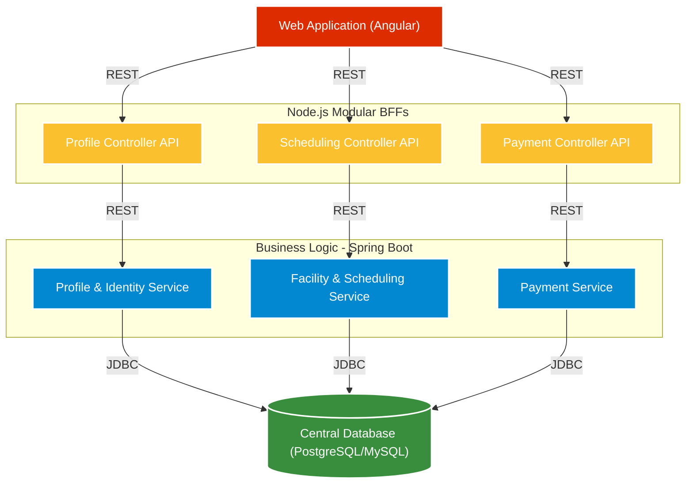
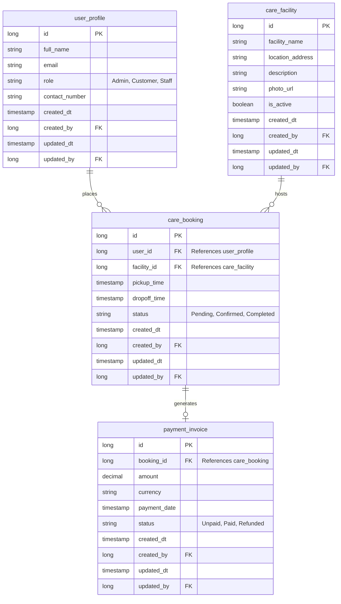

# Helping Hands Care Center (HHCC) - Global Expansion Platform Architecture

## 1. Executive Summary
This document outlines the high-level architecture design for the Helping Hands Care Center (HHCC) digital application. The goal is to provide a scalable, modern, and production-ready architecture using independent components (UI, Node REST Orchestration API, Microservices, and Database) that can be developed in parallel to meet the aggressive 2-week delivery timeline.

### 1.1 Background & Development Goals
**Helping Hands Care Center (HHCC)** currently operates a web application allowing customers to view static photos of individual Care Centers, create user profiles, schedule pick-up and drop-off times, and submit payments safely. With their Corporate and Community care center models achieving wide local success, HHCC has set ambitious growth goals to expand nationally and evolve into a global business over the next three years. 

A primary focus of this development effort is modernizing and scaling their digital capabilities to break into new markets—specifically **pet care** and **elderly care**—while dramatically improving the user experience and differentiating themselves from local competition. The architecture proposed below acts as the robust, scalable foundation necessary to launch these new lines of business and support their global growth strategy.

## 2. High-Level Architecture Diagram
The layout follows a modernized decoupled approach utilizing a Node.js REST Orchestration Layer communicating with REST-only Microservices.



---

## 3. Component Architecture and Tech Stack

### 3.0 Technology Stack Summary
| Layer | Core Technology | Version Specification |
| :--- | :--- | :--- |
| **Frontend UI** | Angular | Angular 18+ |
| **Orchestration** | Node.js (Express/NestJS) | Node.js v22+ |
| **Business Logic**| Java (Build: Maven) | Java 25 & Spring Boot 3+ |
| **Database** | SQL RDBMS | PostgreSQL 16+ or MySQL 8+ |

### 3.1 Presentation Layer (Angular)
- **Framework**: Angular 18+
- **Responsibility**: Manages all user interactions, UI state, and routing. Independent front-end application.
- **Components**: 
  - Care Center Directory / Viewing Static Photos
  - User Registration & Profile Management Portal
  - Appointment Booking & Scheduling Wizard
  - Payment Processing Dashboard
- **Development Strategy**: Mocks can be generated for API responses allowing frontend development to proceed completely parallel to the backend.

### 3.2 Orchestration Layer (Modular Node.js REST API)
- **Framework**: Node.js (Express or NestJS with Modular Routing)
- **Responsibility**: Acts as a strict REST API orchestrator bridging the UI and the backend. 
- **Modular Split for Independent Development**: To avoid merge conflicts and coordination challenges, the Node.js application is logically split into separate independent Route/Controller modules that strictly align with the UI features and backend microservices (e.g., `/api/profile`, `/api/scheduling`, `/api/payment`). This guarantees developers can work on frontend pages, Node.js endpoints, and Spring Boot data models for a specific feature in complete isolation.
- **Benefits**: Simplifies the frontend API calls, completely decouples the developer experience to support parallel vertical feature ownership, and encapsulates microservice boundaries from the public web.

### 3.3 Business Logic Layer (Spring Boot Microservices)
- **Framework**: Spring Boot 3+
- **Language**: Java 25
- **Build Tool**: Maven (`pom.xml`)
- **Resiliency**: Mandate a global `@ControllerAdvice` Exception Handler across all 3 services. This guarantees that any Java database errors (e.g., JDBC `SQLException`) are caught and transformed into safe, standardized HTTP 4xx/5xx JSON payloads, preventing the upstream Node.js Orchestrator from crashing on raw Java stack traces.

Given the 2-week timeframe requirement to deliver maximum 2-3 microservices, we have strategically grouped the domain logic into three core services to avoid overly distributing the system while maintaining scaling patterns.

**Microservice 1: Profile & Identity Service**
- **Domain**: User Identity, Role Management (Customer vs. Staff), Profiles (Human, Pet, Elderly profile details).
- **Responsibilities**: Registration, customer onboarding, preferences management, and identity verification.

**Microservice 2: Facility & Scheduling Service**
- **Domain**: Care Centers, Asset Management, Bookings, Pick-up/Drop-off times.
- **Responsibilities**: Retrieves Care Center locations & photos, manages calendar availability, and processes scheduling of care appointments (pick-up and drop-off).

**Microservice 3: Payment Service (MVP Scope)**
- **Domain**: Invoices, Transactions, Mocked Payment Processing.
- **Responsibilities**: Captures payment requests and tracks status against bookings. Actual end-to-end third-party payment integration (e.g., Stripe, PayPal) is scheduled for the final production implementation; the 1-week MVP will strictly utilize mock payment success responses to hit showcase deadlines.

### 3.4 Database Layer (Single RDBMS)
- **DBMS**: PostgreSQL or MySQL
- **Responsibility**: A single, shared database engine.
- **Data Modeling (Single Schema)**: To radically simplify database interactions while maintaining independent components, the application will operate out of a **single unified schema**. The distinct tables will be designed and logically grouped by functionality (e.g., `tbl_user_profile`, `tbl_care_booking`, `tbl_invoice`), but all 3 Spring Boot microservices will connect directly to this single shared environment.

---

## 4. Independent Development Strategy (1-Week Accelerated Delivery)
By adhering to API-first design and utilizing GitHub Copilot for rapid generation, teams can work simultaneously to compress the timeline into a single week:

- **Day 1 (Architecture & Contracts)**:
  - Finalize all Swagger/OpenAPI specs for UI-to-NodeJS and NodeJS-to-SpringBoot.
  - Scaffold Angular UI, Node.js Orchestrator, and 3 Spring Boot/JDBC projects.

- **Day 2-3 (Parallel Feature Development)**:
  - **UI Team (Angular)**: Uses Copilot to build views, styling, and services mocking the downstream API.
  - **Orchestrator Team (Node.js)**: Implements routing, request validation, and builds "stub" endpoints.
  - **Backend Team (Spring Boot)**: Scaffolds Maven projects, generates JDBC data repositories, handles business logic, and exposes endpoints.

- **Day 4 (Integration)**:
  - Node.js orchestration team removes stubs and points directly to the live Spring Boot APIs.
  - Angular connects through to the live backend stack. Verify end-to-end data flow.

- **Day 5 (QA & Release)**:
  - Run integration tests, fix bugs, apply final CSS polish, and finalize the working demo.

## 5. Security and Cross-Cutting Concerns (MVP Scope)
- **Authentication Flow (MVP)**: For the MVP showcase, authentication is simplified. The Angular UI should pass a hardcoded HTTP header (e.g., `X-Mock-User-Id: 1`) representing an active dummy user. The Node.js layer will trust this header and forward it to the Spring Boot microservices to populate the `created_by` audit fields seamlessly. Full **JWT token validation** is strictly a post-MVP reality.
- **CORS / API Routing**: The Angular Docker container should utilize an `nginx.conf` reverse proxy to serve the front-end on port `80` while seamlessly proxying all `/api/*` traffic internally to the Node.js container's Docker DNS. This completely eliminates UI CORS issues.

---

## 6. Integration and Deployment Strategy

For the scope of the 1-week timeline and the rapid Copilot training assignment format, a streamlined container-based approach should be utilized to guarantee the demo launches smoothly.

### 6.1 Version Control & CI/CD
- **Code Repositories**: Establish a unique GitHub repository (or mono-repo) representing the 3 Tiers (Frontend, Orchestrator, Microservices).
- **GitHub Actions**: Leverage basic GitHub Actions CI pipelines to automate unit testing generated by Copilot and build validation on every feature branch push.

### 6.2 Containerization (Docker)
Ensure environmental consistency from localhost to the final demo space:
- **Angular App**: Packaged using an `nginx:alpine` Docker image offering the static production build directly over HTTP.
- **Node.js Orchestrator**: Containerized using a standard `node:22-alpine` multi-stage build.
- **Spring Boot Microservices**: Generated into lightweight `.jar` files and containerized using a `temurin:25-jre-alpine` layer. 

### 6.3 Local Demo Orchestration (Docker Compose)
To provide the easiest working demo at the end of the assignment, the team should assemble a root `docker-compose.yml` file spanning the entire application stack:
1. Triggers the build for the Angular Web Container, the Node.js Orchestrator Container, and the 3 Spring Boot Microservice Containers.
2. Spins up the standard RDBMS instance (e.g., PostgreSQL).
3. Configures a shared internal docker network allowing the Node.js API to discover the Spring Boot services locally via DNS names (e.g., `http://ms-profile-service:8080`).

### 6.4 Cloud Deployment (Optional)
If deploying to a cloud provider is required for the final evaluation:
- Deploy the **Docker Compose** stack directly to a lightweight VM (AWS EC2, Azure VM).
- Or leverage managed services (e.g. Heroku, Azure App Service) wrapping the respective Docker containers, connecting them to a managed cloud SQL instance.

---

## 7. Unified Database Schema Design

Since all 3 microservices exist within a **Single Schema**, the tables below represent the logical grouping of functional data designed specifically for the Helping Hands Care Center domain.



---

## 8. Team Task Allocation (1-Week Sprint)

Leveraging the **Modular Vertical Feature Ownership** pattern, the team of 7 is structured perfectly to minimize bottlenecks. The Full-Stack developers (Tanuj, Arturo, Alpesh) will own end-to-end feature pipelines (Angular UI + Node Orchestration), while the Backend/Architect heavy-hitters (Sandeep, Naveen, Naga) handle the core Spring Boot JDBC complexities and DB mappings. 

*(Note: Akhil is out of office for Days 1-4. His capacity is reserved strictly for Day 5.)*

### 8.1 Vertical Feature Owners (Full-Stack Squad)
These developers own the top layer of specific domains and build downwards toward the backend.

- **Tanuj (UI / Node / Java)**: *Owner of the Profile & Identity Domain*
  - **Tasks**: Scaffolds Angular Registration UI, implements `/api/profile` Node.js routing with stubs, and connects the UI vertically to Sandeep's Java service.
- **Arturo (UI / Node / Java)**: *Owner of the Facility & Scheduling Domain*
  - **Tasks**: Builds Angular Care Center Directory + Booking pages, implements `/api/scheduling` Node.js endpoints, and wires the UI to Naveen's Java service.
- **Alpesh (UI / Node / Java)**: *Owner of the Payment Domain*
  - **Tasks**: Builds the Angular Payment Dashboard, implements `/api/payment` Node.js endpoints, and tests the mock payment flows against Naga's Java service.

### 8.2 Core Backend, Database, & Infrastructure Squad
These developers own the absolute bedrock of the application. **Sandeep and Naveen explicitly own all Database Schema Design and Table generation** across all domains, completely abstracting DB creation away from the rest of the team.

- **Sandeep (Solution Architect / Backend / DB)**: *Project Lead & DB Architect*
  - **Tasks**: Co-designs the entire unified Database Schema and generates all SQL tables on Day 1 alongside Naveen. Oversees the API Contracts and implements the Maven **Profile Spring Boot Microservice** (JDBC mappings).
- **Naveen (Solution Architect / Backend / DB)**: *Infrastructure & DB Architect*
  - **Tasks**: Co-designs all SQL tables with Sandeep, providing the ready-to-use table schemas to the team. Builds the MVP `docker-compose.yml` container orchestration stack and implements the **Scheduling Spring Boot Microservice** logic.
- **Naga (Backend Developer)**: *Payment Backend Owner*
  - **Tasks**: Handed the pre-designed `payment_invoice` DB table from Sandeep/Naveen. Focuses purely on implementing the **Payment Spring Boot Microservice** and its JDBC logic using the provided schema. No DB design required.
- **Akhil (Backend Developer - OOO Days 1-4)**: *Review & Launch Support*
  - **Tasks**: Returns on Day 5 to serve as a fresh set of eyes. Responsible strictly for QA, code reviews, Copilot test validation, and tackling integration bugs before the demo showcase.

---

## 9. Project Directory Structure Diagram

To ensure all 7 team members have a shared understanding of where their specific code resides without stepping on each other's toes, the final mono-repo structure should be laid out as follows:

```text
hhcc-global-platform/
├── docker-compose.yml              # Root MVP Orchestration (Naveen)
├── README.md                       # Copilot Training / Developer Guide
│
├── angular-ui/                     # Front-End Layer
│   ├── src/
│   │   ├── app/
│   │   │   ├── profile/            # Owned by Tanuj
│   │   │   ├── scheduling/         # Owned by Arturo
│   │   │   └── payment/            # Owned by Alpesh
│   │   └── assets/
│   ├── package.json
│   └── Dockerfile
│
├── node-orchestrator/              # Modular Orchestration Layer
│   ├── src/
│   │   ├── profile.controller.ts   # Owned by Tanuj
│   │   ├── scheduling.controller.ts# Owned by Arturo
│   │   └── payment.controller.ts   # Owned by Alpesh
│   ├── package.json
│   └── Dockerfile
│
├── spring-microservices/           # Java 25 / Spring Boot Business Logic
│   │
│   ├── profile-service/            # MVC Logic owned by Sandeep
│   │   ├── src/main/java/com/hhcc/profile/
│   │   ├── pom.xml
│   │   └── Dockerfile
│   │
│   ├── scheduling-service/         # MVC Logic owned by Naveen
│   │   ├── src/main/java/com/hhcc/scheduling/
│   │   ├── pom.xml
│   │   └── Dockerfile
│   │
│   └── payment-service/            # MVP Logic owned by Naga
│       ├── src/main/java/com/hhcc/payment/
│       ├── pom.xml
│       └── Dockerfile
│
└── database/                       # Abstracted DB Layer (Sandeep & Naveen)
    └── init-scripts/
        ├── 01-schema.sql           # Unified schema DLL matching design
        └── 02-mock-data.sql        # Day 1 stub data
```
